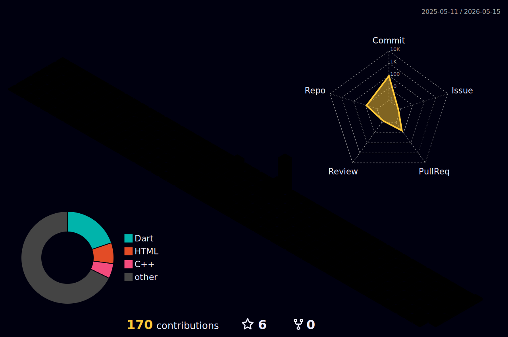

<div align="center">

# 👋 Hi, I'm Atharva Patil

### Software Engineer | Flutter Developer | AIML Enthusiast


<br>

[](https://www.linkedin.com/in/atharvapatil31/)
[](https://medium.com/@atharvapatil.dsa)
[](https://atharvapatil31.github.io)
[](mailto:atharvapatil@example.com)

</div>

---

# 🚀 About Me

```python
class SoftwareEngineer:
    def __init__(self):
        self.name = "Atharva Patil"
        self.role = "Flutter Developer | Python Learner"
        self.location = "India 🇮🇳"

        self.languages = [
            "Python",
            "Dart",
            "C++",
            "Java"
        ]

        self.interests = [
            "Clean Architecture",
            "BLoC State Management",
            "AI/ML",
            "DSA",
            "Video Editing",
            "Marketing"
        ]

    def current_focus(self):
        return [
            "Mastering Python step-by-step",
            "Building production-grade Flutter apps",
            "Contributing to open-source",
            "Learning scalable mobile architecture"
        ]
```

- 🎓 Third-Year Computer Engineering Student at SPPU  
- 📱 Flutter Developer building cross-platform mobile apps  
- 🧠 Learning AI/ML & strengthening DSA foundations  
- 🐍 Currently mastering Python from scratch  
- ✍️ Sharing my journey through technical writing on Medium  
- 🚀 Passionate about building real-world impactful products  
- 🌍 Open to internships & opportunities worldwide  

---

# 🛠️ Tech Stack

<div align="center">

## Languages & Frameworks


<br>

## Backend & Databases


<br>

## Tools & Technologies


</div>

---

# 📊 GitHub Analytics

<div align="center">


</div>

---

# 📈 Contribution Activity

<div align="center">

[](https://github.com/AtharvaPatil31)

</div>

---

# 🧊 3D Contribution Calendar

> ⚙️ _Auto-updated daily via GitHub Actions — each block represents a day of contributions, rendered in 3D._

<div align="center">



</div>

<!-- 
  ════════════════════════════════════════════════════════
  HOW TO SET UP THE 3D CONTRIBUTION CALENDAR
  ════════════════════════════════════════════════════════

  1. Create this file in your repo:
     .github/workflows/profile-3d.yml

  2. Paste the following workflow:

  ──────────────────────────────────────────────────────
  name: GitHub-Profile-3D-Contrib

  on:
    schedule:
      - cron: "0 18 * * *"   # Runs daily at 18:00 UTC
    workflow_dispatch:        # Allows manual trigger

  jobs:
    build:
      runs-on: ubuntu-latest
      name: Generate 3D Contribution Graph

      steps:
        - uses: actions/checkout@v3

        - uses: yoshi389111/github-profile-3d-contrib@0.7.1
          env:
            GITHUB_TOKEN: ${{ secrets.GITHUB_TOKEN }}
            USERNAME: AtharvaPatil31
            SETTING_JSON: |
              {
                "githubUserName": "AtharvaPatil31",
                "startForegroundColor": "#3B82F6",
                "endForegroundColor": "#00ff99",
                "backgroundColor": "#0d1117",
                "type": "rainbow"
              }

        - name: Commit & Push
          run: |
            git config user.name "github-actions[bot]"
            git config user.email "github-actions[bot]@users.noreply.github.com"
            git add -A
            git diff --staged --quiet || git commit -m "chore: update 3D contribution calendar"
            git push
  ──────────────────────────────────────────────────────

  3. Go to: Settings → Actions → General
     → Workflow permissions → Read and write permissions ✅

  4. Manually trigger the workflow once from the Actions tab
     to generate the first SVG.

  The SVG will be saved to: ./profile-3d-contrib/profile-night-rainbow.svg
  and auto-update every day. 🎉
  ════════════════════════════════════════════════════════
-->

---

# 🐍 Contribution Snake

<div align="center">


</div>

---

# 🏆 GitHub Achievements

<div align="center">


</div>

---

# 🚀 Featured Projects

<div align="center">

| Project | Description | Tech Stack |
|----------|-------------|-------------|
| **[Plantlers - Plant Shopping App](https://github.com/AtharvaPatil31/plantlers)** | Production-grade plant e-commerce app with Google/Apple Auth, wishlist, loyalty programme, reminders, and premium UI. | Flutter, Firebase, Dart, Figma |
| **[Suraksha - Women's Safety App](https://github.com/AtharvaPatil31/suraksha_app)** | Real-time emergency response app with SOS alerts, trusted contacts, live GPS tracking, and incident reporting. | Flutter, Firebase, Google Maps |
| **[Sehat Sathi - Telemedicine App](https://github.com/AtharvaPatil31/Sehat_Sathi)** | Remote healthcare platform with appointment booking, AI-assisted triage, secure consultation, and video calling. | Flutter, Python, AIML, REST APIs |
| **[Spotify Clone](https://github.com/AtharvaPatil31/spotify)** | Modern Spotify-inspired music streaming UI with playlists, filtering, immersive animations, and sleek UX. | Flutter, Supabase, Figma |

</div>

---

# 🌱 Currently Learning

```text
✓ Python Fundamentals
✓ Flutter Clean Architecture
✓ BLoC State Management
✓ Data Structures & Algorithms
✓ AI/ML Concepts
✓ Backend Integration
```

---

# 💭 Philosophy

<div align="center">

### ✨ "Stay Hungry Stay Foolish" — Steve Jobs

</div>

```text
Don't stop when you're tired.
Stop when you're done.
```

---

# 🌐 Let's Connect

<div align="center">

[](https://www.linkedin.com/in/atharvapatil31/)
[](https://medium.com/@atharvapatil.dsa)
[](https://github.com/AtharvaPatil31)

</div>

---

<div align="center">

### ⭐️ From Atharva Patil


</div>
